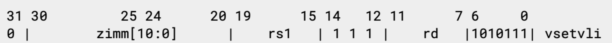

# riscv-v-spec Issue #369

Author: David-Horner

David-Horner提议将 vtype 寄存器中当前未使用的位分配为保留给自定义使用。

下表为v0.8版本 vtype 寄存器的位分配情况：

### table1. vtype register layout

Bits | Name | Description
---- | ---- | -----------
XLEN-1 | vill | Illegal value if set
XLEN-2:7 | Reserved (write 0) |
6:5 | vediv[1:0] | Used by EDIV extension
4:2 | vsew[2:0] | Standard element width (SEW) setting
1:0 | vlmul[1:0] | Vector register group multiplier (LMUL) setting

下图为 vsetvli 指令的形式：

其中 vsetvli 指令中的11位立即数即为 vtype 寄存器的低11位映射，在映射到 vsetvli 的11位中，有7位与 lmul/sew/ediv 一起使用。

David-Horner提议在剩下的4位中，1位（VType中的10位）用于自定义使用。这是 vsetvli 可直接寻址的未分配位的25%。David-Horner进一步建议我们分配位11用于自定义使用。这将允许单个加载立即数提供两个较低的自定义使用位。

此外，David-Horner建议我们从 vtype[30:12] 中分配更多的位供自定义使用。现在这样做将允许在当前的设计和测试阶段早期提出建议，这些设计可能会因为它们经过经验评估而被采纳。

David-Horner提出了几点理由支撑vtype第11位作为自定义用途的适当性：

首先，在当前标准下，位11点使用存在一些问题，加载立即数将生成一个负值，与vsetvl一起使用时将设置vill，且生成位11本身需要多条指令。但是当位11作为一个自定义位使用时，可以用来做很多事，比如：

* 位11被设置时，忽略vill位
* 位11被设置时，将vtype[31:12]置0
* 位11被设置时，补足vtype所有位（或位[31:12]）
